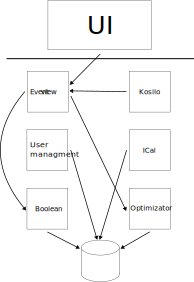

# prpo-app

## Skupina
- Ime skupine: **FRIDOM**
- 4. skupina
- Člani: **Monika Simičak**, **Adrian Sebastian Šiška**
- GitHub povezava: [github.com/orgs/prpo-skupina4](https://github.com/orgs/prpo-skupina4)

## Projekt
- Ime: **FRITIME**
- Opis: Prilagodljiv urnik FRI
   Aplikacija, ki samodejno prebere podatke o predavanjih in vajah z urnikov (Preko protokola iCal). 
   Na podlagi uporabnikovih želja in filtrov sestavi optimalen urnik.
   Uporabnik lahko nastavi svoje preference (npr. zgodnji ali pozni začetek, prosti dnevi, skupina prijateljev), aplikacija pa poišče najboljšo kombinacijo terminov.
   Možno je tudi ustvarjanje skupnih urnikov za več uporabnikov in dodajanje časa za skupno kosilo.

- Ogrodja in razvojno okolje:
    - Azure
    - FastAPI
    - GitHub
    - Kubernetes
    - Python
    - SQLite
    - VSCode
    - Zig

### Seznam mikrostoritev
- Entry\
    Http routing.
- Event view\
    Vrne podatke o urniku za prikaz. (Monika)
- Optimizator\
    Optimizira urnik glede na želje, filtre. (Monika)
- Boolean\
    Vrne podatke skupnega urnika za več oseb. (Adrian)
- Kosilo\
    Doda kosilo na urnik, ki si ga deli več ljudi. (Adrian)
- User managment\
    Poskribi za avtentiakcijo in avtorizacijo uporabnikov. (Adrian)
- iCal\
    Prevzame podatke o urniku iz iCal povezave. (npr. `urnik.fri.uni-lj.si`) (Monika)

### Primeri uporabe

- Uporabnik se prijavi v aplikacijo, prikaže mu njegov urnik.
- Uporabnik želi drugačen urnik, npr. noče imeti v petek obveznosti, uporabi filter in aplikacija mu generira nov urnik.
- Uporabnik želi najti uro, ko ima z drugim uporabnikom hkrati pavzo. Klikne na gumb "kombiniraj urnik" in izbere enega ali več uporabnikov.
Aplikacija mu prikaže kombiniran urnik.
- Uporabnik želi vključiti kosilo v urnik, klikne gumb "dodaj kosilo", na urniku se mu prikaže ena izmed možnosti za kosila, lahko jo potrdi ali pa zahteva nov urnik s klikom na gumb, "drug termin". (Kjer sodeluje več mikrostoritev)

### Shema arhitekture
{ width=50% }
